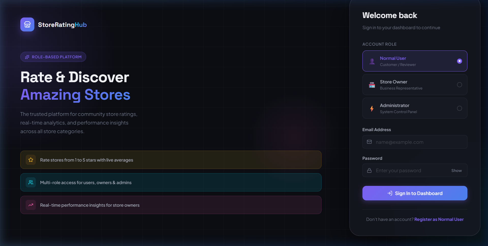
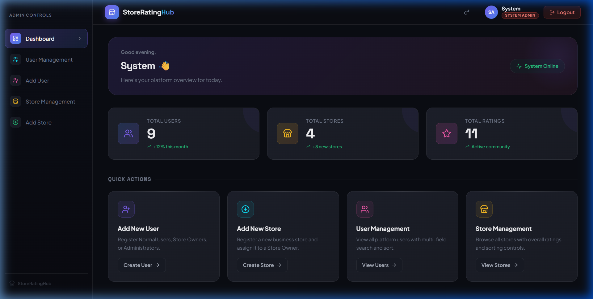
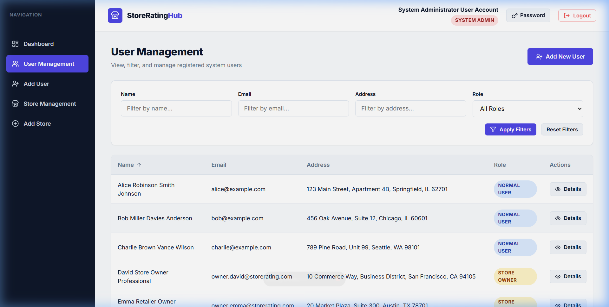
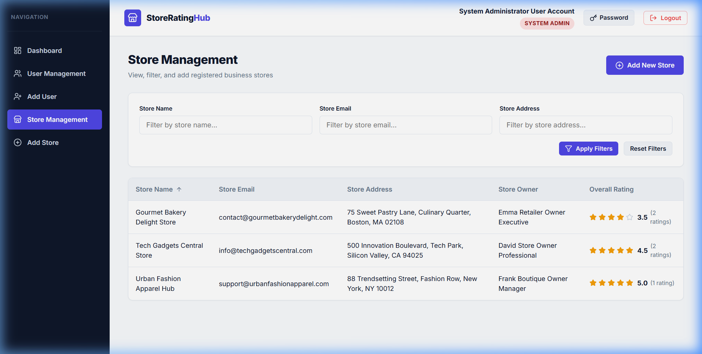
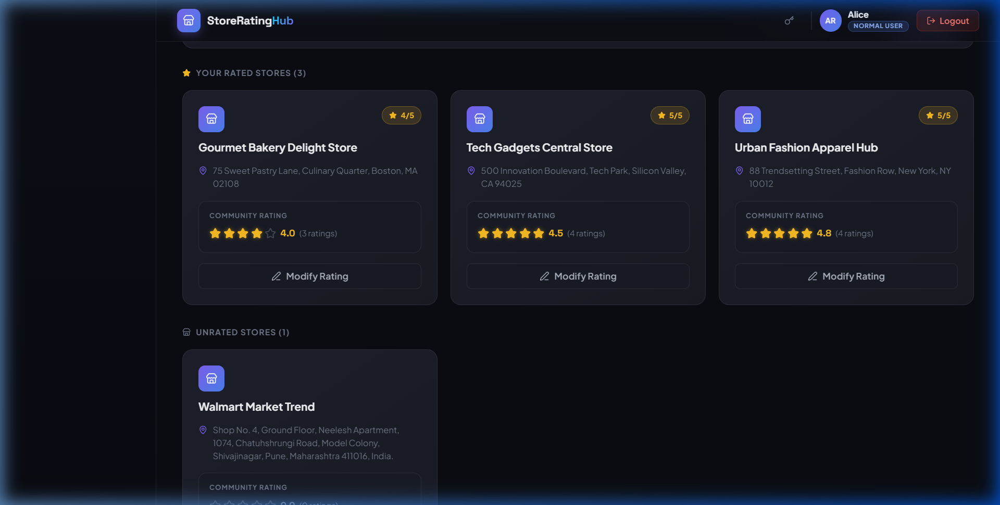
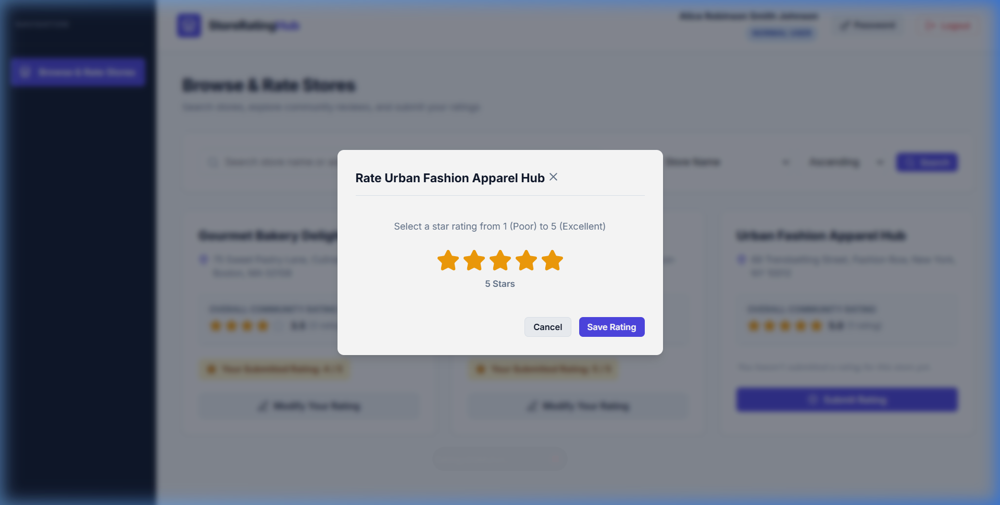
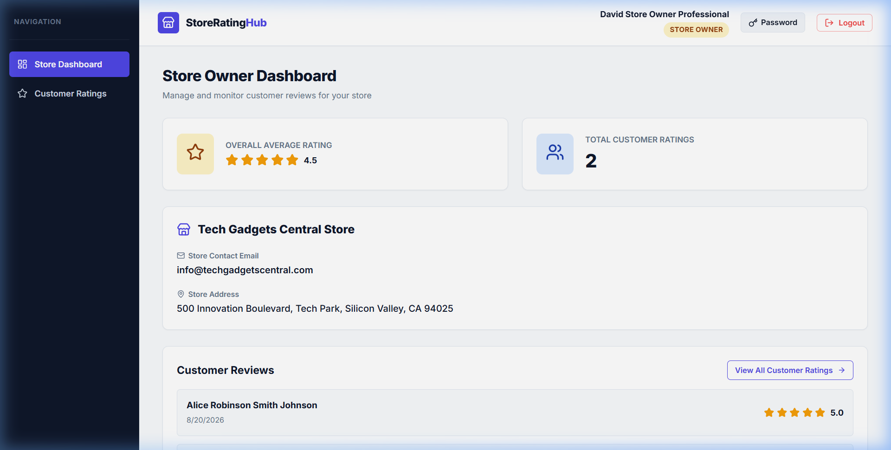
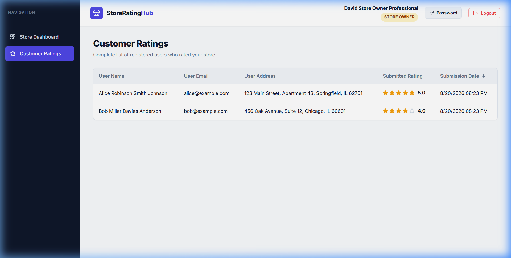

# 🏪 Store Rating Platform

A full-stack, production-quality web application built for managing stores and customer ratings with **Role-Based Access Control (RBAC)**, robust form validation, dynamic rating calculations, and a **premium dark-mode UI**.

---

## 📸 Application Screenshots

### 🔐 Login Page — Role-Based Sign In
> Split-panel design with radio card role selection, animated hero section, and glassmorphic form



---

### 📊 Admin Dashboard — Platform Overview
> Greeting banner, live stat cards (Total Users, Stores, Ratings), system status, and quick action grid



---

### 👥 User Management — Admin Panel
> Filterable and sortable table of all registered users with role badges and detail view



---

### 🏪 Store Management — Admin Panel
> Sortable store listing with average star ratings, owner assignments, and filter controls



---

### 🛍️ User Dashboard — Browse & Rate Stores
> Dark store cards split by Rated / Unrated sections with community rating stars



---

### ⭐ Rating Modal — Submit / Update Store Rating
> Interactive 1–5 star rating modal with quality label feedback (Poor → Excellent)



---

### 📈 Store Owner Dashboard — Performance Metrics
> Rating hero banner with dynamic color score, stat cards, store info, and recent customer reviews



---

### 📋 Customer Ratings — Owner Review Breakdown
> Complete sortable table of all customers who rated the owner's store



---

## 📌 Project Overview

The **Store Rating Platform** enables users to register, log in, browse business stores, submit star ratings (1–5), update their ratings, and view overall statistics. The platform strictly enforces access control across three user roles:

1. **`SYSTEM_ADMIN`** — Full platform management: dashboard metrics (`totalUsers`, `totalStores`, `totalRatings`), user/store creation for any role, filterable & sortable user and store tables, individual user detail inspection.
2. **`NORMAL_USER`** — Self-registration, searchable store browsing (by name/address), star rating submission/modification (1 rating per store enforced at DB level), password management.
3. **`STORE_OWNER`** — Dedicated store performance dashboard with overall average rating, total ratings count, and complete customer review table. Strict data isolation enforced.

---

## ✨ Features

- 🔐 **JWT Authentication & RBAC** — Centralized auth with bcrypt password hashing and role guards on both frontend and backend
- 🛡️ **Strict Form Validation** — Name (20–60 chars), Email format, Password (8–16 chars, ≥1 uppercase, ≥1 special symbol), Address (max 400 chars)
- 📊 **Dynamic Rating Calculation** — Average ratings computed via database aggregations (`_avg`, `_count`) — always fresh
- 🔒 **DB-Level Unique Constraints** — `@@unique([userId, storeId])` prevents duplicate ratings at the database layer
- 🔍 **Filtering & Column Sorting** — Admin tables support multi-field filtering and sortable columns (Name, Email, Address, Role, Rating)
- 🎨 **Premium Dark-Mode UI** — Glassmorphism cards, vibrant gradient accents, micro-animations, gold star ratings with glow effects

---

## 🛠️ Technology Stack

| Layer | Technology |
|---|---|
| **Frontend** | React.js (Vite), React Router DOM v6, Axios, Lucide Icons, Plain CSS |
| **Backend** | Node.js, Express.js |
| **Database** | PostgreSQL 17 |
| **ORM** | Prisma ORM v5 |
| **Authentication** | JSON Web Tokens (`jsonwebtoken`), Password Hashing (`bcryptjs`) |
| **Validation** | Zod Schema Validation |

---

## 📂 Project Architecture

```
Internship Assignment/
├── backend/
│   ├── src/
│   │   ├── config/          # Database client configuration
│   │   ├── controllers/     # Express HTTP request & response handlers
│   │   ├── middlewares/     # JWT auth, RBAC, Zod validation, error handling
│   │   ├── routes/          # Route definitions (/api/auth, /api/admin, etc.)
│   │   ├── services/        # Core business logic & database queries
│   │   ├── validators/      # Zod validation schemas
│   │   ├── utils/           # JWT helpers & response formatters
│   │   ├── app.js           # Express application setup
│   │   └── server.js        # Server listener entry point
│   ├── prisma/
│   │   ├── schema.prisma    # PostgreSQL database models & enums
│   │   └── seed.js          # Database seed script for test accounts
│   ├── .env.example         # Template for environment configuration
│   └── package.json
├── frontend/
│   ├── src/
│   │   ├── api/             # Axios instance with JWT interceptors
│   │   ├── components/      # Navbar, Sidebar, SortableTable, StarDisplay, RatingInput, Modal, Loader, AlertMessage
│   │   ├── context/         # AuthContext for session management & role routing
│   │   ├── layouts/         # Main Dashboard Layout
│   │   ├── pages/           # Login, Register, Admin, User & Store Owner pages
│   │   ├── App.jsx          # React Router setup with role guards
│   │   ├── index.css        # Global CSS design system (dark theme)
│   │   └── main.jsx
│   └── package.json
├── screenshots/             # Application UI screenshots
└── README.md
```

---

## 🗄️ Database Schema

The PostgreSQL database contains 3 core models:

**`User`** — `id` (UUID), `name` (20–60 chars), `email` (unique), `passwordHash`, `address` (max 400 chars), `role` (enum: `SYSTEM_ADMIN | NORMAL_USER | STORE_OWNER`)

**`Store`** — `id` (UUID), `name`, `email`, `address`, `ownerId` (unique FK to User — 1-to-1 relation)

**`Rating`** — `id` (UUID), `rating` (int 1–5), `userId` (FK), `storeId` (FK), `@@unique([userId, storeId])` — one rating per user per store enforced at DB level

---

## 🔑 Test Credentials

### System Administrator
| Field | Value |
|---|---|
| Email | `admin@storerating.com` |
| Password | `AdminPassword123!` |
| Access | `/admin/dashboard` |

### Store Owners
| Email | Password | Store |
|---|---|---|
| `owner.david@storerating.com` | `OwnerPassword123!` | Tech Gadgets Central Store |
| `owner.emma@storerating.com` | `OwnerPassword123!` | Gourmet Bakery Delight Store |
| `owner.frank@storerating.com` | `OwnerPassword123!` | Urban Fashion Apparel Hub |

### Normal Users
| Email | Password |
|---|---|
| `alice@example.com` | `UserPassword123!` |
| `bob@example.com` | `UserPassword123!` |
| `charlie@example.com` | `UserPassword123!` |

---

## 🚀 Setup & Running Instructions

### Prerequisites
- Node.js (v18+)
- PostgreSQL (v14+) running on `localhost:5432`

### Step 1 — Backend Setup

```bash
cd backend
npm install
```

Create `backend/.env` (copy from `.env.example`):
```env
DATABASE_URL="postgresql://postgres@127.0.0.1:5432/storeratingdb"
PORT=5000
JWT_SECRET="your_secret_key_here"
JWT_EXPIRES_IN="24h"
```

```bash
npx prisma db push      # Push schema to PostgreSQL
npm run seed            # Seed test accounts & stores
npm run dev             # Start backend on http://localhost:5000
```

### Step 2 — Frontend Setup

```bash
cd frontend
npm install
npm run dev             # Start frontend on http://localhost:5173
```

---

## 🌐 API Endpoint Overview

### Authentication (`/api/auth`)
| Method | Endpoint | Description |
|---|---|---|
| POST | `/api/auth/register` | Register a Normal User |
| POST | `/api/auth/login` | Login (returns JWT token) |
| PUT | `/api/auth/change-password` | Change password (authenticated) |
| GET | `/api/auth/me` | Get current user profile |

### System Admin (`/api/admin`) — Requires `SYSTEM_ADMIN` role
| Method | Endpoint | Description |
|---|---|---|
| GET | `/api/admin/dashboard` | Platform statistics |
| POST | `/api/admin/users` | Create user (any role) |
| GET | `/api/admin/users` | List users with filters & sorting |
| GET | `/api/admin/users/:id` | User detail view |
| POST | `/api/admin/stores` | Create store with owner assignment |
| GET | `/api/admin/stores` | List stores with filters & sorting |

### Stores & Ratings
| Method | Endpoint | Access |
|---|---|---|
| GET | `/api/stores` | Authenticated — search & list stores |
| POST | `/api/stores/:id/ratings` | NORMAL_USER — submit rating |
| PUT | `/api/stores/:id/ratings` | NORMAL_USER — update rating |
| GET | `/api/store-owner/dashboard` | STORE_OWNER — performance dashboard |
| GET | `/api/store-owner/ratings` | STORE_OWNER — customer review table |

---

## 📝 Key Design Decisions

1. **Self-Registration**: Only Normal Users can self-register. Store Owners and Admins are created by the System Administrator.
2. **Single Store per Owner**: One-to-one unique FK constraint on `Store.ownerId`.
3. **Rating Integrity**: DB-level `@@unique([userId, storeId])` ensures no duplicate ratings even under concurrent requests.
4. **Dynamic Averages**: Ratings are aggregated on query via Prisma `_avg` — never stale.
5. **Dual-Layer Security**: Backend `authorizeRoles()` middleware + frontend `RoleProtectedRoute` component — unauthorized URL access is blocked at both layers.
